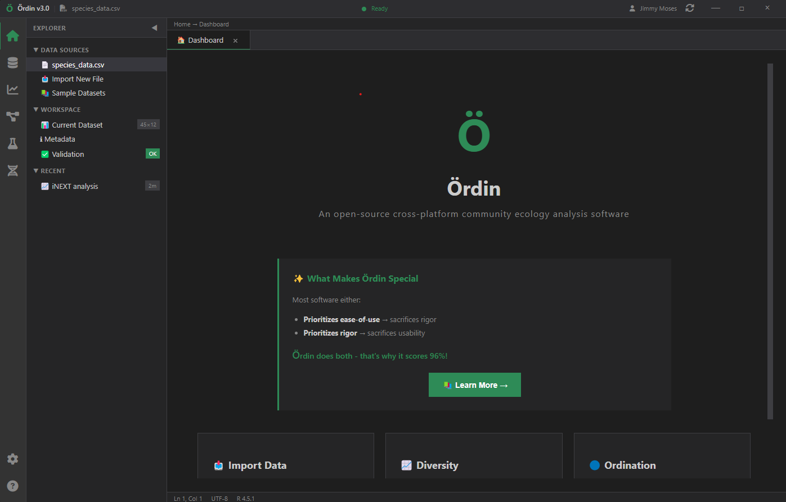
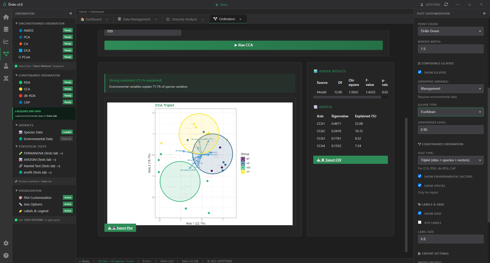
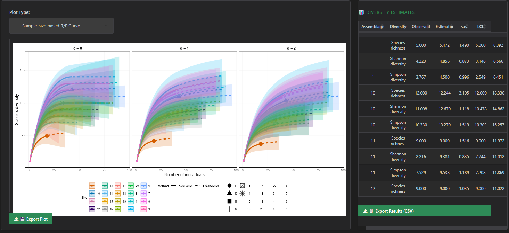
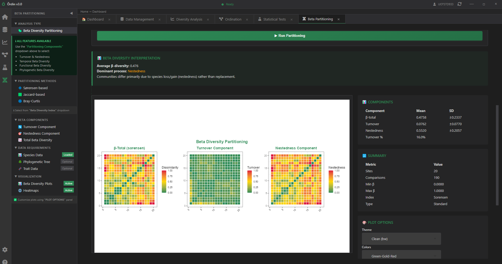
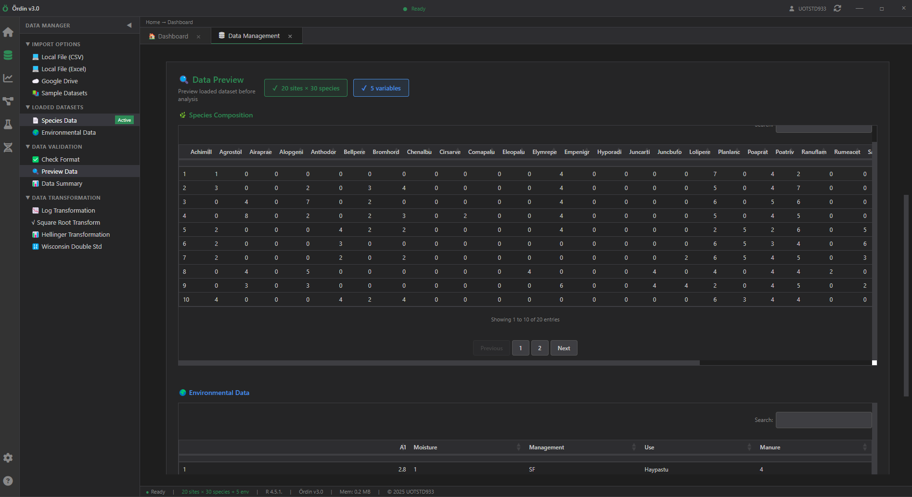

# Ördin - Next-Gen Open-Source Community Ecology Analysis

<div align="center">


**The Next-Gen Way to Analyze Ecological Communities**

[](https://ordin.in4metrix.dev)
[](https://github.com/jm0535/0rdin/releases)
[](https://opensource.org/licenses/MIT)
[](https://github.com/jm0535/0rdin)

[Features](#features) • [Download](#download) • [Documentation](#documentation) • [Gallery](#gallery)

</div>

---

## Why Ördin?

Most ecological software forces you to choose:
- ❌ **User-friendly** tools → Lack statistical rigor
- ❌ **Rigorous** tools → Steep learning curves

**Ördin delivers both.** Real R analyses (vegan, iNEXT, betapart) run in WebAssembly through webR — in your browser or in the desktop app — wrapped in a modern, keyboard-driven interface. Nothing to install, no server, your data never leaves your machine.

### At a Glance

| | Ördin | Typical Software |
|---|:---:|:---:|
| **No R install required** | ✅ R runs as WebAssembly | ❌ |
| **No R coding required** | ✅ | ❌ |
| **Runs in the browser** | ✅ | ❌ |
| **Publication-ready exports** | ✅ 600 DPI | ⚠️ Limited |
| **Real-time plot customization** | ✅ 18+ parameters | ❌ |
| **Beta diversity partitioning** | ✅ Full suite | ⚠️ Partial |
| **Modern UI/UX** | ✅ VS Code-inspired | ❌ Outdated |
| **Cross-platform** | ✅ Win/Mac/Linux | ⚠️ Limited |
| **Learning curve** | Minutes | Weeks to months |

---

## Features

### 🧬 Comprehensive Analysis Suite

<details open>
<summary><strong>📊 Diversity Analysis</strong></summary>

**Diversity Estimation (iNEXT)**
- Rarefaction & extrapolation curves
- Hill numbers (q=0, 1, 2)
- Individual-based & incidence-based
- Bootstrap confidence intervals
- Coverage-based standardization

**Diversity Indices (vegan)**
- Shannon, Simpson, InvSimpson, Fisher's Alpha
- Evenness: Pielou's J', Simpson's E, Evar
- Species accumulation curves
- Rarefaction for sample comparison

</details>

<details open>
<summary><strong>🗺️ 9 Ordination Methods</strong></summary>

**Unconstrained**
- NMDS - Non-metric multidimensional scaling
- PCA - Principal components analysis
- CA - Correspondence analysis
- DCA - Detrended correspondence analysis
- PCoA - Principal coordinates analysis

**Constrained** (environmental data)
- CCA - Canonical correspondence analysis
- RDA - Redundancy analysis
- db-RDA - Distance-based RDA
- CAP - Canonical analysis of principal coordinates

**Advanced Features**
- 5 distance measures (Bray-Curtis, Jaccard, etc.)
- Confidence ellipses with validation
- Species scores overlay
- Environmental vector fitting
- Data transformations (Hellinger, Chi-square, etc.)

</details>

<details open>
<summary><strong>🦠 Beta Diversity Partitioning</strong></summary>

**Available since v3.0, R-verified in v4.**

- Standard partitioning (turnover + nestedness)
- Temporal beta diversity
- Functional beta diversity (trait-based)
- Phylogenetic beta diversity
- Sørensen, Jaccard, Bray-Curtis indices
- 3-panel heatmap visualizations
- Automatic ecological interpretation

</details>

<details>
<summary><strong>🧪 Statistical Tests</strong></summary>

- PERMANOVA - Permutational MANOVA
- ANOSIM - Analysis of similarities
- Mantel test - Matrix correlation
- envfit - Environmental vector fitting

</details>

### 🎨 Modern User Experience

**VS Code-Inspired Interface**
- Frameless window with custom title bar
- Three-panel layout: Activity bar + Sidebars + Canvas
- Multi-tab workspace
- Dark/Light theme toggle
- Responsive, modern design

**Real-Time Plot Customization** ⚡
- 18+ parameters with instant updates
- 6 themes: Clean, Minimal, Dark, Classic, Light, Void
- Typography control (fonts, sizes)
- Visual elements (points, lines, grids)
- CI ribbons, legends, facets
- **No re-rendering required!**

**Comprehensive Settings**
- Appearance (theme, font, zoom)
- Plot defaults (DPI, format, dimensions)
- Analysis defaults (methods, parameters)
- Performance optimization
- Data validation

### 📤 Publication-Quality Exports

**Plot Formats**
- PNG, PDF, SVG, TIFF
- Up to 600 DPI resolution
- Customizable dimensions
- Theme-consistent output

**Data Exports**
- CSV, Excel, JSON
- Scores, eigenvalues, statistics
- Complete reproducibility

---

## Download

### Latest Release: v4.0.0

<div align="center">

| Platform | How to get it |
|----------|---------------|
| **Web / PWA** | [Open ordin.in4metrix.dev](https://ordin.in4metrix.dev) — install from the address bar |
| **Windows** | [Setup.exe](https://github.com/jm0535/0rdin/releases) |
| **macOS** | [.dmg](https://github.com/jm0535/0rdin/releases) |
| **Linux (Debian)** | [.deb](https://github.com/jm0535/0rdin/releases) |
| **Linux (Fedora)** | [.rpm](https://github.com/jm0535/0rdin/releases) |

</div>

**Installation:**
- **Web**: nothing to install — the R runtime is cached on first visit
- **Windows**: double-click the `.exe` installer
- **macOS**: open the `.dmg` and drag Ördin to Applications
- **Debian/Ubuntu**: `sudo dpkg -i ordin_4.0.0_amd64.deb`
- **Fedora/RHEL**: `sudo dnf install ordin-4.0.0-1.x86_64.rpm`

💡 **No R installation required!** Ördin ships R compiled to WebAssembly (webR).

---

## Gallery

### Dashboard

*Modern interface with quick access to all features*

### NMDS Ordination

*Non-metric multidimensional scaling with confidence ellipses*

### Diversity Estimation

*Rarefaction curves with bootstrap confidence intervals*

### Beta Partitioning

*Turnover and nestedness components visualization*

### Plot Customization

*Real-time plot editing with 18+ parameters*

---

## Documentation

### Quick Start
1. **Load Data** - Upload CSV/Excel or use sample datasets
2. **Choose Analysis** - Select from Diversity, Ordination, or Beta Partitioning
3. **Customize** - Use right panel for real-time plot adjustments
4. **Export** - Download high-resolution plots and data

### Comprehensive Guides
- [Documentation Index](DOCS-INDEX.md) — everything, organised
- [Quick Start](QUICKSTART.md)
- [Data Import Guide](guides/DATA_MANAGEMENT_GUIDE.md)
- [Ordination Tutorial](guides/ENTERPRISE_ORDINATION_GUIDE.md)
- [Plot Customization](guides/PLOT-CUSTOMIZATION-GUIDE.md)
- [Biplot Guide](guides/BIPLOT_GUIDE.md)

### For developers
- [Architecture](ARCHITECTURE.md)
- [Development Guide](DEVELOPMENT.md)
- [API Reference](API.md)
- [Stack Audit](ORDIN_STACK_AUDIT_2026-09-26.md)

---

## Perfect For

### 👩‍🔬 Researchers
- Peer-reviewed statistical methods
- Publication-quality exports
- Reproducible workflows
- Fast analysis turnaround

### 👨‍🎓 Students
- No coding barrier
- Interactive learning
- Sample datasets included
- Clear visualizations

### 💼 Consultants
- Professional reports
- Client-ready plots
- Efficient workflow
- Cross-platform compatibility

### 👨‍🏫 Educators
- Teaching tool
- Demonstration-friendly
- Conceptual focus
- Immediate results

---

## Technical Specifications

### Powered By
- **webR** - R 4.4 compiled to WebAssembly
- **Tauri** - lightweight cross-platform desktop shell
- **React + Vite + Zustand** - application front end
- **DuckDB-WASM + Apache Arrow** - in-browser data engine
- **deck.gl + MapLibre** - optional site maps
- **vegan / iNEXT / betapart / adespatial** - the statistics

### System Requirements
- **Browser**: any recent Chrome, Edge, Firefox or Safari with WebAssembly
- **OS (desktop build)**: Windows 10+, macOS 11+, Linux (64-bit)
- **RAM**: 4 GB minimum, 8 GB recommended
- **Disk**: ~500 MB for the desktop bundle (includes the R runtime)

### R Packages Available
vegan, iNEXT, betapart, adespatial, FD, picante, ape, cluster, permute, MASS, mgcv, ggplot2

---

## Community

### Support
- **Issues**: [GitHub Issues](https://github.com/jm0535/0rdin/issues)
- **Discussions**: [GitHub Discussions](https://github.com/jm0535/0rdin/discussions)
- **Email**: jimmy.moses@pnguot.ac.pg

### Contributing
We welcome contributions! See our [Contributing Guide](../.github/CONTRIBUTING.md).

### Code of Conduct
Please read our [Code of Conduct](../.github/CODE_OF_CONDUCT.md).

---

## Citation

If you use Ördin in your research, please cite:

```bibtex
@software{moses2026ordin,
  author = {Moses, Jimmy},
  title = {Ördin 4: A Browser-Native and Desktop Workbench for Community Ecology Analysis},
  year = {2026},
  version = {4.0.0},
  url = {https://github.com/jm0535/0rdin}
}
```

---

## License

MIT License - Free and open source forever.

See [LICENSE](../LICENSE) for details.

---

## Acknowledgments

Inspired by Odin's wisdom from Norse mythology, Ördin brings clarity to complex ecological data.

Built with ❤️ for the ecology community by [Jimmy Moses](mailto:jimmy.moses@pnguot.ac.pg).

**Special Thanks:**
- vegan package developers
- iNEXT package developers
- betapart package developers
- adespatial package developers
- R Core Team and the webR team
- Tauri, React and DuckDB teams

---

<div align="center">

### ⭐ Star us on GitHub!

If Ördin helps your research, please consider giving us a star on [GitHub](https://github.com/jm0535/0rdin).

[](https://github.com/jm0535/0rdin/stargazers)

</div>

---

**Last Updated:** September 2026 | **Version:** 4.0.0 | **Status:** Production Ready
